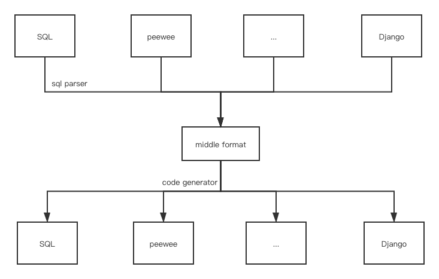

# sql-convertor

Convert SQL table definition to peewee/django/... model definition

Convert peewee model definition to SQL

Convert django model definition to peewee



## install

    pip3 install sql-convertor 

## usage

    $ convertor --help
    $ ...

## example

```shell script
$ echo "CREATE TABLE \`t_record\` ( \
\`c_id\` INT(64) NOT NULL AUTO_INCREMENT COMMENT '自增主键', \
PRIMARY KEY (\`c_id\`), \
KEY \`ix_company\` (\`c_company_id\`) USING BTREE \
) ENGINE=InnoDB DEFAULT CHARSET=utf8mb4 COMMENT='记录表';" > 1.sql
# only support create table definition
# 只支持建表语句
# convertor 是程序入口名称
# sql 是数据来源格式
# peewee 是输出代码格式
# 1.sql 是来源文件
# 用法就是 convertor 源格式 目标格式 来源文件/代码
$ convertor sql peewee 1.sql
```
The output
```python3
class Record(BaseModel):
    """本段代码由程序从SQL建表语句自动生成, 需要帮助请联系 zp0int@qq.com"""
    id = peewee.IntegerField(
        verbose_name="自增主键",
        null=False,
        primary_key=True,
        column_name="c_id")

    class Meta:
        table_name = "t_record"
        database = db

    def to_dict(self):
        return {
            "id": self.id
        }
```

```shell script
$ convertor sql peewee 1.sql out.py
$ cat out.py
# output is the same as above
```

```shell script
$ convertor sql peewee "CREATE TABLE \`t_record\` ( \
    \`c_id\` INT(64) NOT NULL AUTO_INCREMENT COMMENT '自增主键', \
    PRIMARY KEY (\`c_id\`), \
    KEY \`ix_company\` (\`c_company_id\`) USING BTREE \
    ) ENGINE=InnoDB DEFAULT CHARSET=utf8mb4 COMMENT='记录表';"
# output is the same as above
```

## unittest

    sh unittest.sh

